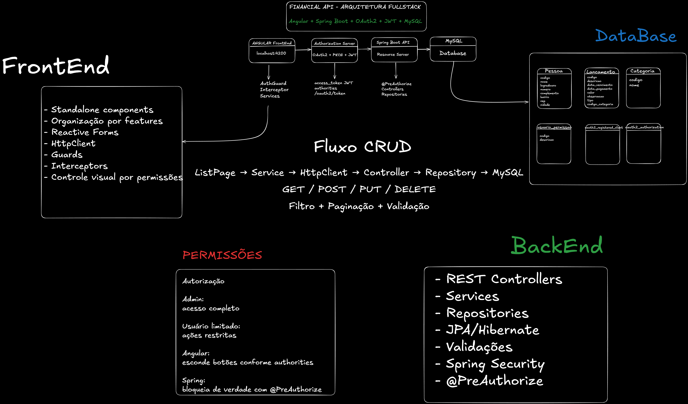
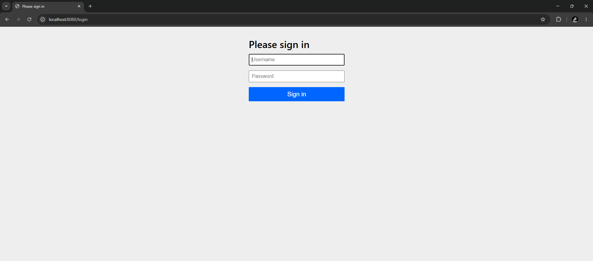
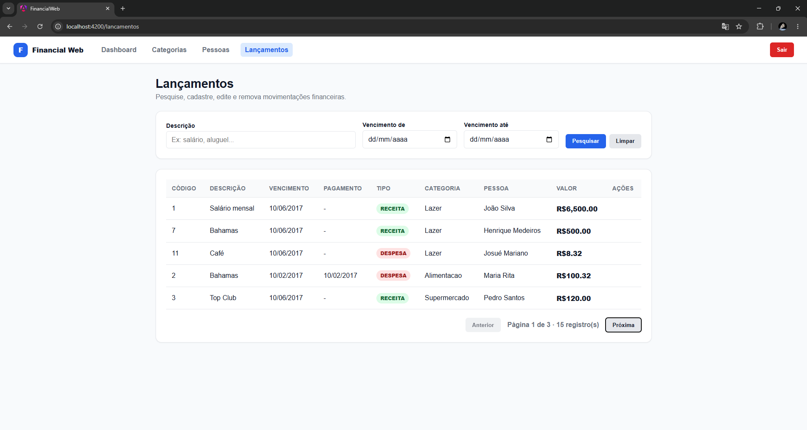

# Financial Application Fullstack

Sistema financeiro fullstack desenvolvido com **Angular** no frontend e **Spring Boot** no backend, integrado com **MySQL** e autenticação baseada em **OAuth2, JWT e controle de permissões por roles**.

O objetivo do projeto foi construir uma aplicação próxima de um cenário real de mercado, indo além de um CRUD simples. O sistema possui autenticação, autorização, controle visual por permissões, filtros, paginação, cadastro, edição e exclusão de lançamentos financeiros.

---

## Visão geral

Este repositório contém o projeto fullstack completo:

```text
backend/   -> API REST com Spring Boot
frontend/  -> Aplicação Angular
docs/      -> Diagramas, screenshots e documentação visual
```

A aplicação permite gerenciar lançamentos financeiros, pessoas e categorias, com controle de acesso baseado nas permissões do usuário autenticado.

---

## Arquitetura



O arquivo editável do diagrama está disponível em:

```text
docs/architecture/financial-web-architecture.excalidraw
```

---

## Tecnologias utilizadas

### Backend

- Java
- Spring Boot
- Spring Security
- Spring Authorization Server
- OAuth2
- JWT
- JPA / Hibernate
- MySQL
- Flyway
- Maven
- Bean Validation
- API REST

### Frontend

- Angular
- TypeScript
- SCSS
- RxJS
- Angular Router
- Reactive Forms
- Standalone Components
- HttpClient
- Guards
- Interceptors

### Banco de Dados

- MySQL
- Migrations com Flyway

---

## Funcionalidades

### Autenticação e segurança

- Login com OAuth2 Authorization Code Flow + PKCE
- Emissão de access token JWT
- Envio automático do token via interceptor Angular
- Proteção de rotas com AuthGuard
- Controle de permissões no backend com `@PreAuthorize`
- Controle visual no frontend baseado nas authorities do JWT
- Tratamento de erros 401 e 403
- Logout com limpeza de token e sessão

### Lançamentos

- Pesquisa de lançamentos
- Filtro por descrição
- Filtro por data de vencimento
- Paginação server-side
- Cadastro de lançamento
- Edição de lançamento
- Exclusão de lançamento
- Validações no formulário
- Associação com pessoa e categoria

---

## Fluxo de autenticação

O sistema utiliza o fluxo **OAuth2 Authorization Code Flow com PKCE**, adequado para aplicações SPA.

Fluxo simplificado:

```text
1. O usuário acessa o Angular
2. Clica em "Entrar"
3. O Angular redireciona para /oauth2/authorize no backend
4. O Spring Authorization Server autentica o usuário
5. O backend redireciona para /callback com um authorization code
6. O Angular troca o code por um access_token
7. O token é salvo no sessionStorage
8. O interceptor adiciona Authorization: Bearer <token>
9. O backend valida o JWT
10. As permissões são verificadas com @PreAuthorize
```

---

## Controle de permissões

O backend define permissões por usuário e envia essas permissões dentro do JWT.

Exemplo de authorities:

```json
{
  "authorities": [
    "ROLE_PESQUISAR_LANCAMENTO",
    "ROLE_CADASTRAR_LANCAMENTO",
    "ROLE_REMOVER_LANCAMENTO"
  ]
}
```

No frontend, essas permissões são usadas para melhorar a experiência do usuário, escondendo botões e ações que ele não pode executar.

Exemplo:

```text
Usuário sem ROLE_REMOVER_LANCAMENTO
-> não visualiza o botão "Excluir"
```

A proteção real continua sendo feita no backend com Spring Security:

```java
@PreAuthorize("hasAuthority('ROLE_REMOVER_LANCAMENTO')")
```

---

## Usuários de teste

| Usuário | Senha | Perfil |
|---|---|---|
| admin@email.com | admin | Acesso completo |
| maria@email.com | maria | Acesso limitado |

---

## Como rodar o projeto

### Pré-requisitos

Antes de iniciar, instale:

- Java 21 ou superior
- Node.js 22 LTS
- Angular CLI
- MySQL
- Maven

Verifique as versões:

```bash
java --version
node --version
npm --version
ng version
```

---

## Rodando o backend

Entre na pasta do backend:

```bash
cd backend
```

Configure o banco de dados no arquivo de propriedades do backend, conforme sua configuração local.

Exemplo:

```properties
spring.datasource.url=jdbc:mysql://localhost:3306/financial_application
spring.datasource.username=root
spring.datasource.password=sua_senha
```

Execute a aplicação:

```bash
./mvnw spring-boot:run
```

No Windows:

```bash
mvnw spring-boot:run
```

A API ficará disponível em:

```text
http://localhost:8080
```

---

## Rodando o frontend

Entre na pasta do frontend:

```bash
cd frontend
```

Instale as dependências:

```bash
npm install
```

Execute o Angular:

```bash
ng serve
```

A aplicação ficará disponível em:

```text
http://localhost:4200
```

---

## Configuração da URL da API

A URL base da API fica centralizada no frontend em:

```text
frontend/src/app/core/config/api.config.ts
```

Exemplo:

```ts
export const API_CONFIG = {
  baseUrl: 'http://localhost:8080',
};
```

---

## Principais endpoints

### Lançamentos

```http
GET /lancamentos?resumo=true
POST /lancamentos
GET /lancamentos/{codigo}
PUT /lancamentos/{codigo}
DELETE /lancamentos/{codigo}
```

### Pessoas

```http
GET /pessoas
GET /pessoas/{codigo}
```

### Categorias

```http
GET /categorias
```

### Autenticação OAuth2

```http
GET /oauth2/authorize
POST /oauth2/token
POST /logout
```

---

## Screenshots

### Login



### Pesquisa de lançamentos



---

## Conceitos aplicados

- Arquitetura cliente-servidor
- API REST
- Autenticação OAuth2
- Authorization Code Flow com PKCE
- JWT
- Controle de permissões por roles
- Guards no Angular
- Interceptors no Angular
- Reactive Forms
- Validação no frontend e backend
- Paginação server-side
- Filtros com query params
- Organização por features
- Separação de responsabilidades
- Persistência com JPA/Hibernate
- Migrations com Flyway

---

## Status do projeto

Projeto funcional e finalizado como projeto de portfólio.

Principais recursos implementados:

- Autenticação
- Autorização
- CRUD de lançamentos
- Filtros
- Paginação
- Integração Angular + Spring Boot
- Controle visual por permissões
- Layout responsivo
- Documentação arquitetural

---

## Melhorias futuras

Algumas melhorias possíveis para evolução do projeto:

- Deploy do backend em ambiente cloud
- Deploy do frontend em Vercel, Netlify ou similar
- Testes automatizados no backend
- Testes automatizados no frontend
- Tela de dashboard com indicadores financeiros reais
- Refresh token com estratégia mais robusta
- Melhorias de UX com componentes reutilizáveis
- Docker Compose para subir backend, frontend e banco de dados

---

## Repositório

Este repositório contém o projeto fullstack:

```text
backend/  -> Spring Boot API
frontend/ -> Angular Web App
docs/     -> Documentação visual e arquitetura
```

---

## Autor

Desenvolvido por **Rodrigo Zanetti Durigan**.

- LinkedIn: https://www.linkedin.com/in/rodrigo-zanetti-durigan
- GitHub: https://github.com/rodrigozanettidurigan
